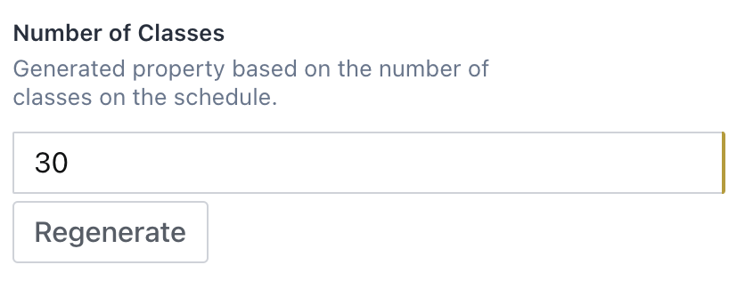
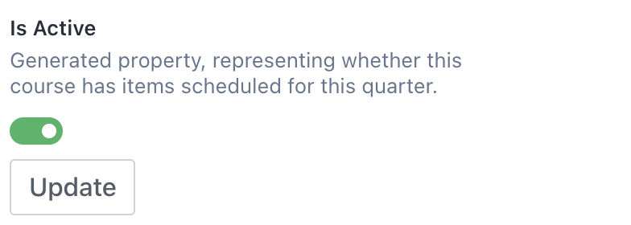

# sanity-plugin-computed-field

This plugin computes a field's value based on other fields or relationships with its document. In other words, this field memoizes a value in a document using [GROQ](https://www.sanity.io/docs/query-cheat-sheet) to lookup and custom javascript to compute the value from those GROQ results.

## Installation

```bash
sanity install computed-field
```

Then you can use the `ComputedField` as an input component to help calculate values. The computed field supports `number`, `text`, `string`, or `boolean` type.

## Configure

```typescript
import ComputedField from 'sanity-plugin-computed-field'

{
  name: "...", //Give your sanity field a name
  type: "number", //"number" or "text" or "string" or "boolean"
  inputComponent: ComputedField,
  options: {
    editable: true or false,
    buttonText: "Regenerate",
    documentQuerySelection: `
      _id,
      "numberOfReferences": count(*[references(^._id)])
    `
    reduceQueryResult: (resultOfQuery) => {
      return resultOfQuery.numberOfReferences
    }
  }
}
```

#### `options.documentQuerySelection` (required)

Defines the body of the query **on the current document being edited**. Result of this query is passed to 'reduceQueryResult'. This selection is made every time "Regenerate" is clicked.

#### `options.reduceQueryResult` (required)

Returns the value to populate computed field, based on the query result of 'documentQuerySelection'. This function is called every time "Regenerate" is clicked and the GROQ query successfully is made.

#### `options.editable` (default `false`)

Whether user can also edit the computed field directly.

#### `options.buttonText` (default `"Regenerate"`)

What text should be in button user clicks to recompute the value.

# A Comprehensive Example

See [examples/courseBook](./examples/courseBook.ts) for full example.

Say we ran a university. We have a corpus of courses, and each course has many scheduled times. Each scheduled course has an instructor teaching.

We might want to compute whether the course is active, or the number of scheduled classes at a given point of time (for example, the beginning of the year).

```typescript
import ComputedField from 'sanity-plugin-computed-field'

const Course = {
  name: 'course',
  title: 'Title for Course',
  description: 'Represents a given course taught at Sanity U',
  type: 'document',
  fields: [
    {
      name: 'title',
      title: 'Title',
      description: 'Please give this course a title',
      type: 'string',
    },
    {
      title: 'Is Active',
      description: 'Whether this course has scheduled items remaining this quarter.',
      type: 'boolean',
      inputComponent: ComputedField,
      options: {
        editable: true,
        documentQuerySelection: `
        "numScheduled": count(*[_type == "scheduledCourse" && references(^._id) && startTime > ${new Date().toISOString()}])
        `,
        reduceQueryResult: (queryResult: {numScheduled: number}) => {
          return queryResult.numScheduled > 0
        },
      },
    },
    {
      title: 'Number of classes this quarter',
      description: 'Computed by number of classes on the schedule',
      type: 'string',
      inputComponent: ComputedField,
      options: {
        documentQuerySelection: `
        "numScheduled": count(*[_type == "scheduledCourse" && references(^._id)])`,
        reduceQueryResult: (queryResult: {numScheduled: number}) => {
          return queryResult.numScheduled
        },
      },
    },
  ],
}
```

# Field Examples

### `type: "number"`



### `type: "text"`


### `type: "string"`


### `type: "boolean"`


